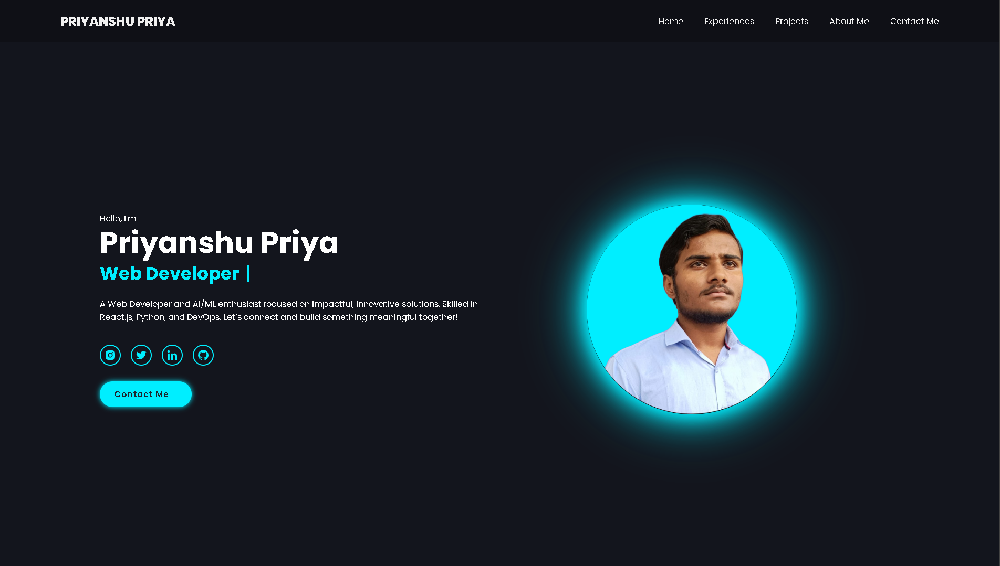

# Priyanshu Priya's Portfolio

Welcome to my portfolio website! This website showcases my projects, experiences, and skills as a web developer and AI/ML enthusiast.

## Live Preview

Check out the live version of my portfolio [here](https://priyanshupriya.netlify.app/).

## Table of Contents
- [About Me](#about-me)
- [Technologies Used](#technologies-used)
- [Features](#features)
- [Projects](#projects)
- [Contact](#contact)

## About Me

👋 Hi, I'm Priyanshu Priya, a passionate web developer and AI/ML enthusiast. I enjoy creating engaging web applications and exploring new technologies. This portfolio is a reflection of my work and skills.

## Technologies Used

- **HTML**: Structure of the web pages.
- **CSS**: Styling and layout.
- **JavaScript**: Interactivity and dynamic content.
- **React.js**: Frontend framework for building user interfaces.
- **Python**: Used for backend development and AI/ML projects.
- **Git**: Version control for tracking changes in my projects.

## Features

- **Responsive Design**: The website is fully responsive and adapts to various screen sizes.
- **Project Showcase**: Highlighting my projects with detailed descriptions.
- **Contact Form**: A fully functional contact form that sends messages directly to my inbox, allowing visitors to get in touch easily.

## Projects

Here are some notable projects featured on my portfolio:

1. **TrueFaceAI**: An AI-based solution for detecting fake images/videos.
2. **ClimaLens**: A climate data visualization website providing insights into climate data.
3. **Responsive News Aggregator**: A modern news website fetching real-time news using the NewsAPI.

## Contact

If you'd like to get in touch, you can find me on:
It looks like you've included the same link for both GitHub and Twitter in your contact section. Here's the updated version with the correct links for each platform:

- **Email**: priyanshupriyacodes@gmail.com
- **LinkedIn**: [LinkedIn Profile](https://www.linkedin.com/in/priyanshu-priya)
- **GitHub**: [GitHub Profile](https://github.com/priyanshu-priya)
- **Twitter**: [Twitter Profile](https://twitter.com/priyanshupriya_)
- **Portfolio**: [Portfolio Website](https://priyanshupriya.netlify.app/)

Thank you for visiting my portfolio!
